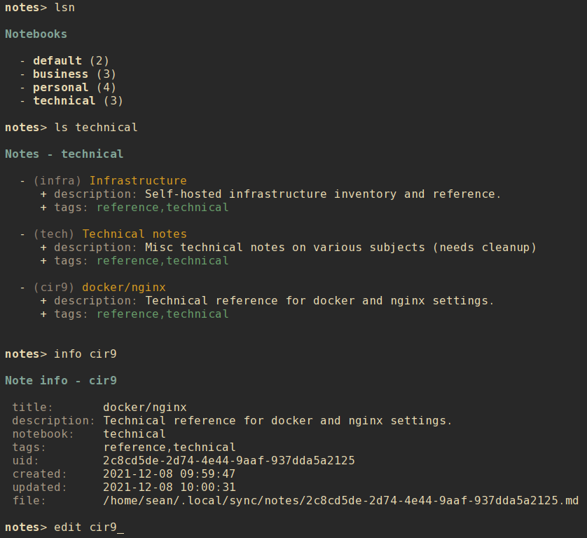

# nrrdnote

A terminal-based notes management program with advanced search options, formatted output, and note data stored in local text files.

## Contents

- [Getting nrrdnote](#getting-nrrdnote)
    - [Downloading](#downloading)
    - [Python dependencies](#python-dependencies)
    - [Installing](#installing)
        - [Setuptools](#setuptools)
        - [Make](#make)
- [Using nrrdnote](#using-nrrdnote)
    - [Basic usage](#basic-usage)
    - [Command-line usage](#command-line-usage)
        - [Listing notes and notebooks](#listing-notes-and-notebooks)
        - [Display info about a note](#display-info-about-a-note)
        - [Viewing or editing a note](#viewing-or-editing-a-note)
        - [Creating a new note](#creating-a-new-note)
        - [Modifying a note](#modifying-a-note)
        - [Deleting a note](#deleting-a-note)
        - [Archiving a note](#archiving-a-note)
        - [Searching notes](#searching-notes)
        - [Exclusion](#exclusion)
        - [Search examples](#search-examples)
        - [Paging](#paging)
    - [Interactive shell](#interactive-shell)
        - [Interactive modify](#interactive-modify)
        - [A note about refresh](#a-note-about-refresh)
    - [Configuration](#configuration)
        - [Default configuration](#default-configuration)
        - [Alternate configuration](#alternate-configuration)
        - [Editing configuration](#editing-configuration)
        - [Main configuration options](#main-configuration-options)
        - [Color configuration options](#color-configuration-options)
    - [Note data](#note-data)
        - [Note data fields](#note-data-fields)
            - [Managed fields](#managed-fields)
            - [User-modified fields](#user-modified-fields)

## Getting `nrrdnote`
### Downloading
To download `nrrdnote` simply clone this repository:

    git clone https://github.com/sdoconnell/nrrdnote.git

### Python dependencies
`nrrdnote` requires Python 3.8+ and the following Python 3 libraries to be available:

- `pyyaml`
- `rich`
- `watchdog`
- `dateutil`
- `tzlocal`

You may install these dependencies from your Linux distribution's repos (if available) or via `pip` using the `requirements.txt` file provided in this repository:

    pip install -r requirements.txt

### Installing
You may install the application one of two ways: via `setuptools`, or via `make`. Installing via `make` will also install the manpage for `nrrdnote(1)` and will copy the `README.md` file into your system documentation directory.

#### Setuptools
Run the `setup.py` script to install system-wide (likely requires `su` or `sudo`):

    sudo python3 setup.py install

Alternatively, you may install the package to your `$HOME` directory.

    python3 setup.py install --user

#### Make
Use `make` to install the application system-wide (likely requires `su` or `sudo`):

    sudo make install

There is also an `uninstall` operation available:

    sudo make uninstall

## Using `nrrdnote`
### Basic usage
`nrrdnote` is a terminal-based application that can be run in either of two modes: command-line or interactive shell.

    nrrdnote -h
    usage: nrrdnote [-h] [-c <file>] for more help: nrrdnote <command> -h ...

    Terminal-based notes management for nerds.

    commands:
      (for more help: nrrdnote <command> -h)
        archive             archive a note
        delete (rm)         delete a note file
        edit                edit a note file (uses $EDITOR)
        info                show metadata about a note
        list (ls)           list notes
        modify (mod)        modify metadata for a note
        new                 create a new note
        search              search notes
        shell               interactive shell
        version             show version info

    optional arguments:
      -h, --help            show this help message and exit
      -c <file>, --config <file>
                            config file

### Command-line usage
#### Listing notes and notebooks
There are several options for listing your notes:

- `list all` (or `lsa`) : list all of your notes, divided by notebook.
- `list notebooks` (or `lsn`) : list all notebooks and the count of notes contained.
- `list <notebook>` : list notes for a specific notebook.

Entries are listed in the following tabular format:

        - (alias) title
          + description: description
          + tags: tags

- **Line 1**: the note alias and title.
- **Line 2**: the note description.
- **Line 3**: any tags assigned to the note.

#### Display info about a note
Use the `info` subcommand to see the full metadata for a note.

    nrrdnote info 5kzb

#### Viewing or editing a note
Use the `edit` subcommand to open the note file in your preferred editor. Use care not to corrupt the metadata info stored at the top of the notes file between `---` markers. Malformed file structure may result in `nrrdnote` being unable to properly parse the file.

    nrrdnote edit 5kzb

#### Creating a new note
Use the `new` subcommand to create a new note. This option will create a new note file in your `nrrdnote` data directory (`$XDG_DATA_HOME/nrrdnote` or `$HOME/.local/share/nrrdnote` by default). See `nrrdnote new -h` for all available options and their command syntax.

    nrrdnote new [options]

The new note will open in your preferred `$EDITOR` when created.

#### Modifying a note
Note metadata may be changed using the `modify` command. See `nrrdnote modify -h` for all available options and their command syntax.

    nrrdnote modify <alias> [options]

#### Deleting a note
Use the `delete` subcommand to delete a note identified by the record's `alias`. Confirmation will be required for this operation unless the `--force` option is also used.

    nrrdnote delete <alias> [--force]

#### Archiving a note
Use the `archive` subcommand to move the note file to the subdirectory `archive` in the the notes data directory. Confirmation will be required for this operation unless the `--force` option is also used.

Archived notes will no longer appear in lists of notes. This can be useful for retaining old notes without resulting in endlessly growing note lists. To review archived notes, create an alterate config file with a `data_dir` pointing to the archive folder, and an alias such as:

    alias nrrdnote-archive="nrrdnote -c $HOME/.config/nrrdnote/config.archive"

#### Searching notes
Search results are output in the same tabular, human-readable format as that of `list`, but also include excerpts for matching search results.

The most basic form of search is to simply search for a keyword or string in the note text:

    nrrdnote search <search_term>

A regular expression may be used to search note text by enclosing the term in `/` (i.e., `/<regex to search for>/`).

Optionally, a search type may be specified. The search type may be one of `uid`, `alias`, `title`, `description`, `notebook`, `tags`, or `note`. If an invalid search type is provided, the search type will default to `note` (the note text). To specify a search type, use the format:

    nrrdnote search [search_type=]<search_term>

You may combine search types in a comma-delimited structure.

**Restrictions:**
- The `note` type supports regular expression searches. However, use of a comma (`,`) in the regex itself will cause a failure in processing the search expression.

All other types perform case-insensitive, plain text searches.

The tags search type may also use the optional `+` operator to search for more than one tag. Any matched tag will return a result.

The special search term `any` can be used to match all notes, but is only useful in combination with an exclusion to match all records except those excluded.

## Exclusion
In addition to the search term, an exclusion term may be provided. Any match in the exclusion term will negate a match in the search term. An exclusion term is formatted in the same manner as the search term, must follow the search term, and must be denoted using the `%` operator:

    nrrdnote search [search_type=]<search_term>%[exclusion_type=]<exclusion_term>

The exclusion term may be a regular expression, following the same restrictions as for search. A regular expression exclusion can also be used in conjunction with a search term that includes search types.

## Search examples
Search for any note containing the word "projectx":

    nrrdnote search projectx

Search for any note containing the words "ProjectX", "ProjectY", or "ProjectZ", using a regular expression:

    nrrdnote search /Project[XYZ]/

The same search with an explicit `note` type:

    nrrdnote search note=/Project[XYZ]/

A similar search using an explicit `note` search is case-insensitive but can only search for "ProjectX":

    nrrdnote search note=projectx

Search for all notes tagged "development" or "testing" in the "Projects" notebook, except those that contain information about ProjectA or ProjectB:

    nrrdnote search notebook=Projects,tags=development+testing%/[Pp]roject[aAbB]/

#### Paging
Output from `list`, `search`, and `info` can get long and run past your terminal buffer. You may use the `-p` or `--page` option in conjunction with `search`, `list`, or `info` to page output.

### Interactive shell
`nrrdnote` also features an interactive mode, enabled by `shell`. This mode offers commands similar to the command-line options, but in a persistent shell-like environment.

Most commands are similar to their command-line argument analogs:

- `list <view>` (or `lsa`, `lsn`)
- `config`
- `new`
- `archive <alias>`, confirmation is always required (no `--force`).
- `info <alias>`
- `edit <alias>`
- `modify <alias>`
- `delete <alias>` (or `rm <alias>`), confirmation is always required (no `--force`).
- `search <term>`
- `help [command]`

A couple of additional shell-specific commands exist:
- `clear` : clear the shell output.
- `refresh` : re-read the note files on disk if edits were made outside of `nrrdnote`.

#### Interactive modify
To modify a note in interactive mode, use the command `modify <alias>` to enter a subshell for modifying the record. When done making changes, you may leave the subshell with the command `done`. For available commands, use the `help` command while in the modify subshell. The syntax is similar to that for the CLI modify command, with the exception that it is not necessary to specify an alias with the subcommands (due to the subshell context being a specific note). For example:

CLI usage:

    nrrdnote modify aw4d --tags +development,testing

Interactive usage:

    notes> modify aw4d
    modify (aw4d)> tags +development,testing
    modify (aw4d)> done
    notes>

All changes made while in the `modify` subshell take effect (and are saved) immediately.

#### A note about `refresh`
When using `new`, `edit`, or `delete` it is **not** necessary to perform a manual `refresh` afterward. This is done automatically when the previous operation is completed. In general, a manual `refresh` should not be needed but the functionality is included to cover edge cases.
 
### Configuration
#### Default configuration
By default, `nrrdnote` reads its configuration from a config file located at either `$XDG_CONFIG_HOME/nrrdnote/config` or `$HOME/.config/nrrdnote/config`. If the default configuration file does not exist, `nrrdnote` will attempt to create the file with default options specified.

#### Alternate configuration
Instead of the default configuration file, an alternate config file may be selected by using the command-line argument `-c <file>`.

#### Editing configuration
For convenience, the `config` command will open the config file in your `$EDITOR`. In interactive shell mode, the configuration will be reloaded after editing and the new settings applied immediately.

#### Main configuration options
The following options are available under the `[main]` header of the configuration file:

- `data_dir` : (str) the location of note files.
- `default_notebook` : (str) the name to use for the default notebook.
- `file_ext` : (str) the optional file extension to use for note files.
- `editor_options` : (str) any options to pass to `$EDITOR` when editing a note. These are the default options, they can be overridden at the command line when using the `edit` subcommand by including the `-o` or `--editor-opts` option.

#### Color configuration options
`nrrdnote` supports customization of colors and bold in output. The following options are available under the `[colors]` header of the configuration file:

- `disable_colors` : (bool) turn off color output.
- `disable_bold` : (bool) turn off bold font output.
- `color_pager` : (bool) turn on or off color output in the pager (disabled by default, enable if your pager supports color output).

The following options under the `[colors]` header can be used to define a custom color scheme. Specify one of the standard terminal color names such as `red`, `black`, `bright_yellow`, etc.

- `table_title` : (str) the color for the table title.
- `note_title` : (str) the color for the note title.
- `description` : (str) the color for note description text.
- `notebook` : (str) the color for notebook text.
- `alias` : (str) the color for alias text.
- `tags` : (str) the color for tags text.
- `label` : (str) the color for field labels.

### Note data
Note files are stored in the `data_dir` defined by the `nrrdnote` configuration file. The default location is `$XDG_DATA_HOME/nrrdnote` or `$HOME/.local/share/nrrdnote`. Each note is stored in its own text file and metadata is serialized in [YAML](https://yaml.org/) format at the top of the file between `---` lines. For more information about editing YAML files, see the [YAML spec](https://yaml.org/spec/1.2/spec.html).

The actual content of the note must follow the second `---` line.

#### Note data fields
In theory, any arbitrary data may be stored in the note metadata block. However, `nrrdnote` will only parse and display the below data set.

##### Managed fields
The following fields are managed by `nrrdnote` and should not be edited directly.

- `uid` : an [RFC 4122](https://datatracker.ietf.org/doc/html/rfc4122) UUID, randomly generated when the record is created via `new`.
- `created` : Datetime timestamp. Generated when the record is created via `new`.

##### User-modified fields
The following fields may be modified by the user.

- `alias` : A randomly-generated 4-digit alias for the note. This may be changed if preferred. Use a short string without spaces. Aliases are case-insensitive.
- `tags` : Tags assigned to the note. (list)
- `title` : The title of the note.
- `description` : The description for the note.
- `notebook` : The notebook for the note.

